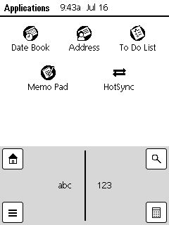
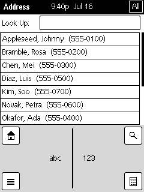
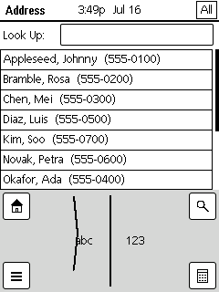

# CYD Palm — a pocket PDA that syncs to iCloud

> A PalmOS-style touchscreen organizer — **Date Book, Address, To Do, Memo**, with
> **Graffiti** handwriting — running on a ~$15 ESP32 "Cheap Yellow Display," that
> two-way syncs to your iCloud **calendars, reminders, and contacts**. Offline by
> default; **HotSync** when you want to. An open-source homage to the Palm Pilot:
> a little more charming, and a lot less demanding, than a smartphone.

<!-- TODO: a photo of the device here is the single best thing this README could add. -->

## What you need

- An **ESP32-2432S028R "Cheap Yellow Display"** (the base, no-PSRAM CYD) — ~$15.
- A **microSD card** (any small size) — holds your Palm databases + config.
- An **iCloud account** with an **app-specific password** — create one at
  appleid.apple.com → *Sign-In & Security → App-Specific Passwords* (needs 2FA).
  It's scoped and revocable, and never exposes your main Apple ID password.
- To build & flash: **ESP-IDF v5.5** + a USB cable. *(There's no prebuilt binary
  yet — you flash it yourself.)*

## Set it up

1. **Build & flash the firmware** — see
   [Build + flash the firmware](#build--flash-the-firmware) below. On first boot
   the device seeds a few demo records so the apps aren't empty.
2. **Make your config** — copy [`firmware/config.ini.example`](firmware/config.ini.example)
   onto the SD card as `config.ini` and edit the Wi-Fi + iCloud lines (SSID,
   password, Apple ID, app-specific password). This is the no-reflash way to
   configure the device; you can also edit these on-screen in **Preferences**.
3. **Point it at your calendars** — on the device, **Preferences → Discover
   collections…** lists your iCloud calendars, reminders lists, and address book;
   tap each to assign it to Date Book / To Do / Address. (Advanced users can instead
   run `bridge_cli discover` on a computer — see below.)
4. **Insert the card and boot.** Tap **HotSync → Sync Now**.
5. **Enjoy a Palm again.** Records you add on the device push to iCloud; changes on
   iCloud pull down on the next sync. Use it offline; HotSync when convenient.

> **Heads-up (honest limitations):** **Memos stay on the device** — iCloud has no
> sync surface for Notes. **To Do** syncs to iCloud's *CalDAV task lists*, which
> the iPhone Reminders app shows only if you add iCloud as an external CalDAV
> account (Settings → Calendar → Add CalDAV Account), not under the built-in
> iCloud reminders. And the first sync will push the **demo seed records** to your
> real iCloud — delete them there (or in the apps) once your own data is in.

## What works today

Booted and proven on hardware: calibrated touch, the classic Palm launcher + apps,
Graffiti text entry, categories, Find, a Calculator, and **bidirectional iCloud
sync** for Date Book, To Do, and Address (records push *and* pull, edits survive,
deletes propagate). The hard part — fitting Wi-Fi + TLS + the sync engine beside
LVGL in ~80 KB of RAM with no PSRAM — is solved. Full status, the build log, and
what's next live in [`docs/`](docs/).

## Try it without hardware — the simulator

The **real firmware UI** (the same `ui.c`, data layer, Graffiti recognizer, Palm
fonts and icons) also builds for your desktop and your **phone browser** — see
[`docs/SIMULATOR_PLAN.md`](docs/SIMULATOR_PLAN.md) and [`sim/`](sim/):

<p>
  
  
  
</p>

```
make -C sim smoke     # native headless: scripted UI tour + screenshots (CI gate)
make -C sim wasm      # browser build via Emscripten -> sim/build/web/
```

The native build needs `/sdcard` to exist (`sudo mkdir -p /sdcard && sudo chmod
777 /sdcard`); LVGL v9.2.2 is fetched automatically on first build. CI builds the
browser simulator on every push (the `palm-simulator-web` artifact) and publishes
it to GitHub Pages: **https://emu-commits.github.io/cyd-palm-bridge/** — open it
on a phone. Sync is stubbed in the simulator — everything else is the real thing.

The simulator models the device's memory, not just its pixels: the LVGL object
pool is the exact 24 KB (on the 32-bit wasm build), and the general heap is
capped at a device-like ~144 KB budget (`sim/sim_heap.h`) so allocations that
would fail on hardware fail in the browser too. Your records **persist in your
browser** (an IndexedDB-backed `/sdcard`, per-device and origin-isolated — other
sites can't read it); **passwords are never persisted** — the secret fields of
`config.ini` are scrubbed before every write to browser storage, so don't expect
credentials to survive a reload (and please don't enter real ones: sync is
disabled in the simulator anyway).

---

# How it works — architecture & build log

A **native PDA on the base CYD** (`ESP32-2432S028R`, **NO PSRAM**, 4 MB flash,
~300 KB SRAM): a PalmOS-style touchscreen handheld that reads/edits Palm PIM
databases and two-way syncs them to CalDAV/CardDAV (iCloud). PumpkinOS is a
*donor codebase* (data formats, fonts, icons, layouts), not a runtime.

## Status (2026-07-09)

Two halves, both real — and joined on hardware with **bidirectional** iCloud sync:

1. **Host bridge — proven.** The Palm↔CalDAV/CardDAV codec + incremental
   conflict-aware two-way sync. Details below.
2. **On-device firmware — working, with two-way iCloud sync.** LVGL UI on the
   CYD: calibrated touch, an authentic Palm launcher/apps (Date Book, Address, To
   Do, Memo), Graffiti text entry (full a–z + 0–9, shift/caps/space/backspace/enter
   gestures), menus, categories, Details, per-record **Delete** (with confirm), a
   **Calculator**, and HotSync. **Bidirectional sync confirmed on device** —
   Date Book + To Do + Address each sync to their own iCloud collection (Address
   over CardDAV); records push *and* pull, edits survive, deletes propagate.
   See **[docs/BUILD_PROGRESS.md](docs/BUILD_PROGRESS.md)** (cold-resume log) and
   **[docs/NEXT_STEPS.md](docs/NEXT_STEPS.md)** (what to do next). Firmware in
   **`firmware/`** (ESP-IDF).

> **The hard part was RAM** (no PSRAM): TLS + Wi-Fi + LVGL + the sync working set
> must coexist in ~80 KB of heap. It fits after shrinking the LVGL pool, enabling
> mbedTLS dynamic buffers, trimming Wi-Fi buffers, and keeping the sync working set
> small. The reconcile struct `S` is a single `calloc` that must sit *beside* the
> mbedTLS handshake, so **`MAXR` stays at 24** (an earlier 24→96 bump broke sync:
> `S` starved the TLS handshake and pulls silently failed). This **caps a
> collection at 24 records** — see NEXT_STEPS for the streaming rework to lift it.
> **Known gaps:** Memo has no iCloud DAV surface (stays local); creds are still
> compile-time in `secrets.h` (on-device `config.ini` is planned); Graffiti has no
> punctuation yet; power + case are the remaining hardware phases.

---

## Host bridge — proven (host build)

The headless bridge is built and **verified against a real DAV server** (Radicale):
`Palm PDB <-> CalDAV/CardDAV` incremental two-way sync with conflict resolution.
Three test gates, all green:

- `make test` → `tests/roundtrip.c`: **285 checks, 0 failures.** PDB codec is lossless
  on every field; the full write→read→emit→parse→repack→reread chain reconstructs
  the originals — including **VALARM, EXDATE, timezone conversion, CP1252↔UTF-8, the
  ToDo/VTODO codec, and the AppInfo category table**.
- `tests/dav_roundtrip.sh`: pushes real PDBs to Radicale, pulls them back into fresh
  PDBs, diffs canonical dumps. **CAL: byte-identical. CARD: property-set identical**
  (vCard doesn't preserve Palm's ordered phone slots; no data is lost/changed).
- `make itest` → `tests/incremental.c`: seeds a collection, makes divergent edits on
  **both** sides (local modify/delete/add + server modify/add + a genuine both-sides
  conflict), syncs under each policy, and asserts **local and server converge** to the
  expected set and that a **second sync is a total no-op (idempotent)**. All three
  policies (server-wins / local-wins / keep-both) pass.
- `make synctoken` → `tests/synctoken.c`: proves the **RFC 6578 sync-collection** delta
  path — initial→token, empty delta when idle, exact `{1 changed, 1 deleted}` delta,
  invalid-token→full-resync, and a delta-driven no-op second sync.

### Layout
```
bridge/palm.h              shared model + module seams (no full DB ever resident)
bridge/pdb.c               PDB container: streaming reader (1 record RAM) + writer
bridge/datebook.c          Appt <-> bytes  (Pack + Unpack; PumpkinOS exceptions bug fixed)
bridge/address.c           Addr <-> bytes  (email-is-a-phone-slot quirk both ways)
bridge/todo.c              Todo <-> bytes <-> VTODO  (due/priority/complete)
bridge/appinfo.c           Palm AppInfo category-table parse/build
bridge/ical.c              Appt <-> VEVENT (emit + the NEW parse/download half)
bridge/vcard.c             Addr <-> VCARD  (emit + parse; UID required by CardDAV)
bridge/tz.[ch]             timezone registry + DST math + UTC->local + VTIMEZONE emission
bridge/charset.[ch]        Palm CP1252/Latin-1 <-> UTF-8
bridge/dav.[ch]            CalDAV/CardDAV via curl (PUT+If-Match/GET/PROPFIND/DELETE) -> esp_http_client on device
bridge/sync.[ch]           push/pull primitives + sync_collection: incremental, conflict-aware two-way sync
bridge/main.c              CLI: discover | push | pull | sync | synccat | dump  (BRIDGE_TZ sets zone)
tests/                     roundtrip.c (codec) + dav_roundtrip.sh (server) + incremental.c (two-way)
                           + synctoken.c (RFC 6578 delta) + category.c (category->collection routing)
                           + bigsync.c (device-sized 90-record stream test) + multiapp.c (ToDo/Address)
                           + run_gates.sh (one command: bring up Radicale, run every gate, tear down)
```

### First-time DAV server setup (for the server-backed tests)
```
python3 -m venv davvenv && ./davvenv/bin/pip install radicale
printf 'palm:palm\n' > radicale.htpasswd
./davvenv/bin/python -m radicale --config radicale.conf &        # localhost:5232
# create the two collections once:
curl -s -u palm:palm -X MKCALENDAR http://localhost:5232/palm/cal/
curl -s -u palm:palm -X MKCOL -H 'Content-Type: application/xml' \
  --data '<D:mkcol xmlns:D="DAV:" xmlns:C="urn:ietf:params:xml:ns:carddav"><D:set><D:prop>\
<D:resourcetype><D:collection/><C:addressbook/></D:resourcetype></D:prop></D:set></D:mkcol>' \
  http://localhost:5232/palm/card/
```

### Run it
```
./tests/run_gates.sh       # EASIEST: starts Radicale, runs every gate, tears down
make                       # builds ./roundtrip, ./bridge_cli, ./incremental, ...
make test                  # codec round-trip (no server)
# real-server tests (Radicale in ./davvenv, config radicale.conf, creds palm:palm):
./davvenv/bin/python -m radicale --config radicale.conf &   # localhost:5232
./tests/dav_roundtrip.sh   # full PDB->server->PDB proof
make itest                 # incremental two-way sync + conflict policies + idempotence
# manual: DAV_BASE/DAV_USER/DAV_PASS/DAV_CAL/DAV_CARD env override the target
./bridge_cli push pdb/DatebookDB.pdb pdb/AddressDB.pdb          # full seed
./bridge_cli sync pdb/DatebookDB.pdb pdb/AddressDB.pdb server   # incremental (policy: server|local|both)
```

### Incremental sync (bridge/sync.c :: sync_collection)
Change detection: **local** = record's canonical-body FNV hash differs from the hash
stored in the map at last sync (or the Palm delete bit is set); **server** = object
ETag differs from the map's stored ETag (or it vanished / appeared). Reconciliation
runs the full (local-state × server-state) matrix — new/mod/del on each side — does the
DAV ops (conditional PUT with `If-Match`, DELETE, GET), writes the merged PDB, and
rewrites the map (`state/<coll>.map`, rows `uid⇥href⇥etag⇥hash`). A **conflict** is a
record changed on both sides; policy resolves it: `server` (server wins), `local` (local
wins), `both` (Palm-style keep-both — server copy stays, local is re-added as a new
record). Modify beats delete under `both`.

### What the real server taught us (not visible in a mock)
- Radicale **validates + normalizes** objects: it injected `DTSTAMP` into events and
  **rejects vCards without a UID** (silent empty-ETag) — fixed by emitting `UID:`.
- Servers return PROPFIND members **unordered**; pull sorts by uniqueID for a
  deterministic PDB.
- vCard is a *set* of typed values, not Palm's fixed 5 ordered phone slots, so slot
  index is not preserved across a round trip (data is). `displayPhone` isn't carried.

### Data fidelity (all closed)
- **Timezones** — `BRIDGE_TZ` sets the device zone (registry in `tz.c`: US + EU zones,
  DST-aware). Timed events emit `;TZID=<zone>` + a matching `VTIMEZONE`, preserving Palm
  wall-clock literally (exact round-trip). Foreign `...Z` UTC inputs convert to device
  local with correct DST offset. Floating (no zone) when `BRIDGE_TZ` is unset.
- **VALARM** — Palm alarm advance/unit ↔ `TRIGGER:-PT<n>M/H` / `-P<n>D`.
- **EXDATE** — Palm exception dates ↔ `EXDATE` (value-type-matched to DTSTART).
- **Charset** — Palm CP1252/Latin-1 ↔ UTF-8 on all text fields (`charset.c`); curly
  quotes, accents, €, … round-trip byte-exact; unmappable UTF-8 → `?`.

### Incremental delta sync — RFC 6578 (done; initial target: iCloud)
The engine prefers the `sync-collection` REPORT (`dav_sync_report`): it sends the
`sync-token` stored from last run and the server returns **only** changed/added/removed
members plus a fresh token — no full listing when nothing changed. Server state is then
built from the map baseline (unchanged) overlaid with the delta, feeding the same
reconciliation matrix. Fallbacks are automatic:
- token **invalid/expired** (`DAV:valid-sync-token`) → full resync with an empty token;
- server **doesn't support** sync-collection → plain `PROPFIND` Depth:1 (no token stored).

The token is persisted as a `#synctoken\t…` header line in `state/<coll>.map`. Proven in
`tests/synctoken.c` against Radicale: initial→token, empty delta when idle, an exact
`{1 changed, 1 deleted}` delta after a server edit+delete, bogus-token→resync, and a
delta-driven no-op second sync.

### iCloud
`bridge_cli discover` runs the CalDAV/CardDAV bootstrap — follows the
`caldav.icloud.com` → `pNN-caldav.icloud.com` redirect, reads `current-user-principal`,
then `calendar-home-set` / `addressbook-home-set`, and lists the collections (with their
absolute per-user URLs). Then:
```
export DAV_BASE=https://caldav.icloud.com
export DAV_USER='you@icloud.com'
export DAV_PASS='xxxx-xxxx-xxxx-xxxx'      # an APP-SPECIFIC password (2FA required)
export BRIDGE_TZ=America/New_York
./bridge_cli discover                       # prints host + collection paths
export DAV_BASE=https://pNN-caldav.icloud.com   # host from discover
export DAV_CAL='1234567890/calendars/home'      # path from discover
export DAV_CARD='1234567890/carddavhome/card'
./bridge_cli sync pdb/DatebookDB.pdb pdb/AddressDB.pdb
```
Notes: iCloud requires **HTTPS** (curl handles it; on-device = mbedTLS) and an
**app-specific password** — the main Apple ID password is rejected under 2FA. iCloud
supports `sync-collection`, so syncs are delta after the first. (Discovery flow verified
against Radicale; live iCloud needs your credentials.)

### Categories → collections + ToDo/Reminders (done)
Palm records carry a category (low nibble of the record attribute byte; labels in the
`AppInfoType` block — `appinfo.c`). `sync_categorized` partitions records by category and
syncs each subset against its **own** DAV collection (own map + sync-token), then writes
one merged PDB with the AppInfo preserved; pulled records are stamped with the category
that owns their collection. `bridge_cli synccat` resolves the routing by **display-name
match** (via `discover`): Palm category "Business" → the calendar named "Business";
unmatched → a default (the "Unfiled" calendar, else `DAV_CAL`). No collection creation,
so it works on iCloud (make the calendars/lists in the UI first).

Applies to the component apps, per the iCloud data model:
- **Calendar** categories → separate calendars ✓
- **ToDo** (new `VTODO` codec — `todo.c`) categories → **Reminders lists** ✓ (a
  Reminders list is a CalDAV collection of VTODOs; use `synccat todo`)
- **Contacts** — one iCloud address book, no per-category collection; categories are
  preserved on the record but not routed.
- **Memos** — iCloud Notes has no CalDAV/CardDAV surface; out of scope.

Proven in `tests/category.c` (`make ctest`): records partition to the right calendars,
the merged PDB keeps each category nibble, a server-side add pulls back tagged with the
owning category, and a second sync is a no-op across all collections.

Both the original ROADMAP phases are **done**: **Phase A** (contact/CardDAV sync,
separate `contacts.icloud.com` host) and **Phase B** (the ESP32 firmware port —
`dav_esp.c` over `esp_http_client`+mbedTLS, PDBs on SD, the sync working set moved
from static BSS to heap for no-PSRAM). See [docs/ROADMAP.md](docs/ROADMAP.md).

---

## On-device firmware — the PDA (`firmware/`, ESP-IDF)

An ESP-IDF app that turns the CYD into a PalmOS-style handheld. Shares the exact
codec + sync engine from `bridge/` (compiled unchanged as an IDF component; only
the DAV transport differs: `dav_esp.c` over mbedTLS instead of `dav.c` over curl).

**Proven on hardware:** boots, calibrated resistive touch (persisted in NVS), the
ILI9341 display in portrait, WiFi→SNTP→TLS→PROPFIND against **live iCloud**
(the discovery smoke test listed the real calendars). ~256 KB free heap after
moving the sync arenas to heap.

**The UI (LVGL, monochrome Palm theme, authentic Palm fonts/icons from PumpkinOS):**
- **Launcher** — an icon grid of the classic Palm apps (real tAIB icons).
- **Silkscreen buttons** flanking the Graffiti area: **Home / Menu / Find / Calc**.
- **Apps** — Date Book, Address, To Do, **Memo Pad** (all four functional): list →
  detail → edit forms with an on-screen keyboard.
- **Menus** (F1) — the Menu button opens Palm's **Record** (New/Delete) and
  **Options** (Categories/About) pull-downs.
- **Categories** (F2) — the top-right category pop-up filters lists, wired to the
  Palm AppInfo table.
- **Details** (F4) — per-record category assignment.
- **HotSync** (U7) — a background sync to iCloud (WiFi+SNTP+sync engine), defensive
  so a network/RAM error can't crash the UI.
- **Graffiti** (U6) — a `$1` unistroke recognizer + writing surface (framework;
  templates/threshold need on-device tuning).

Config (WiFi + Apple app-specific password + calendar path) lives in
`firmware/main/secrets.h` (gitignored; copy from `secrets.h.example`).

### Build + flash the firmware
```
. ~/esp/esp-idf/export.sh          # ESP-IDF v5.5
cd firmware
idf.py set-target esp32            # first time
idf.py -p /dev/ttyUSB0 flash monitor
```
The device seeds demo PDBs on first boot (only for DBs that don't exist), so the
apps have content before a HotSync. Firmware is **GPLv3** (it reuses PumpkinOS's
GPLv3 Palm fonts/icons); the host `bridge/` codecs are clean-room and separable.

### Remaining
- **On-device validation/tuning:** HotSync RAM headroom (WiFi+TLS+sync while LVGL
  is up ≈ 166 KB free vs ~169 KB peak — may need to tear down the LVGL draw buffer
  during sync, the roadmap's mode-switch); Graffiti recognizer accuracy.
- **U8 power** (battery gauge on GPIO34, light-sleep) and **U9 case** — hardware.
- ToDo multi-column/sort/show-completed polish (F3).

---

## History (kept for context)

Emulator paths were ruled out (Dragonfruit needs 8 MB PSRAM; a whole-PumpkinOS port
is desktop-class + a 150 KB framebuffer). The chosen path — native app + PumpkinOS
as a *donor* — proved out: a ~30-line PDB reader + clean-room codecs, no PumpkinOS
DataMgr/storage. PumpkinOS's `ApptUnpack` has an exceptions-loop bug (`.month` set
twice, `.day` never) — fixed in the port. Board on the bench: CH340 @
`/dev/ttyUSB0`, ESP32-D0WD-V3 rev3.1, 4 MB flash, no PSRAM.
