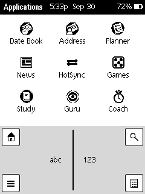
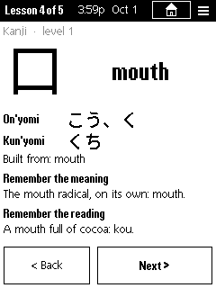
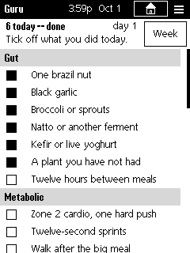
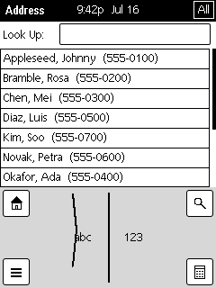

# CYD Palm: a pocket PDA that syncs to iCloud

A PalmOS-style organizer, with **Date Book, Address, a Planner (To Do and
Memo) and Graffiti handwriting**, running on the "Cheap Yellow Display", an
ESP32 board with a 2.8" touchscreen that costs about $15. It syncs both ways
with your iCloud **calendars, reminders and contacts**. It works offline, and
**HotSyncs** when you want it to. An open-source homage to the Palm Pilot:
a little more charming, and a lot less demanding, than a smartphone.

It also has a lock screen with the time, weather and what's coming up; a
news reader; games; **Study**, a spaced-repetition app for kanji or anything
else, with courses on the SD card; and two coaches, **Guru** (daily habits)
and **Coach** (focused work sessions).

<p>
  
  
  
  
</p>

**Try it in your browser:** <https://emu-commits.github.io/cyd-palm-bridge/>.
It's the real firmware UI, built for the web, and works on a phone. Sync is
switched off there; everything else is the real thing.

## What you need

- An **ESP32-2432S028R "Cheap Yellow Display"**: the base board, without PSRAM.
- A **microSD card** of any small size. It holds your Palm databases, the
  settings and Study's courses.
- For sync, an **iCloud account** with an **app-specific password**. Make one
  at appleid.apple.com under *Sign-In & Security → App-Specific Passwords*
  (it needs two-factor authentication). It can be revoked at any time, and
  your main Apple ID password never touches the device.
- A USB cable, and **Chrome or Edge** to install from the browser.

## Install

Open the [Install page](https://emu-commits.github.io/cyd-palm-bridge/flash.html),
press **Install** and pick the board's serial port. The page covers the
snags (a Snap-packaged Chromium, a board that needs BOOT held to start
flashing). Leave **Erase** clear when updating: erasing removes the saved
Wi-Fi and account passwords.

To build and flash it yourself, see
[`docs/ARCHITECTURE.md`](docs/ARCHITECTURE.md#the-firmware-built-yourself)
(ESP-IDF v5.5).

The first boot asks you to calibrate the touchscreen. The apps start with a
few demo records, which are never sent to your account; **Menu ▸ Remove demo
data** clears them.

## Set it up

1. **Wi-Fi:** **Settings ▸ Wi-Fi**. Pick a network and enter its password.
2. **Your account:** **Settings ▸ Accounts**. Enter your Apple ID and the
   app-specific password, then **Find my calendars...** lists your calendars,
   reminders lists and address book. Assign one to each of Date Book, To Do
   and Address.
3. **Sync:** tap **HotSync**. Records you add on the device go up to iCloud,
   and changes made on iCloud come down on the next sync.

Without an account, a HotSync still sets the clock and fetches news and
weather.

You can also prepare the card on a computer: copy
[`firmware/config.ini.example`](firmware/config.ini.example) to the card as
`config.ini` and fill it in. On the next boot the device moves any passwords
into its own flash and blanks them on the card ([`SECURITY.md`](SECURITY.md)).

**Limits worth knowing:**
- **Memos stay on the device.** iCloud Notes has no sync interface.
- **To Do syncs to iCloud's CalDAV task lists.** The iPhone's Reminders app
  shows them only if you add iCloud as a CalDAV account (Settings → Calendar
  → Add CalDAV Account), not under the built-in iCloud reminders.
- **Very large calendars and address books:** the device has very little
  RAM, and a collection of more than a few hundred records is refused rather
  than synced partly. This is being worked on (`docs/BACKLOG.md`, the sync
  engine).

## Study courses

Study ships with a two-level demo kanji course. Other courses are built on a
computer and copied to the card:

```
pip install -r tools/requirements-course.txt
python3 tools/mkcourse.py path/to/my-course     # writes path/to/my-course/course.srs
```

Copy `course.srs` to `/study/<course-id>/` on the card. A course can be a
plain front/back deck (a `cards.tsv`) or a full WaniKani-style one;
[`docs/COURSE_FORMAT.md`](docs/COURSE_FORMAT.md) is the guide.

## How it's built

[`docs/ARCHITECTURE.md`](docs/ARCHITECTURE.md) covers the parts (`bridge/`,
`firmware/`, `sim/`), the sync engine, how everything fits in the memory of a
board with no PSRAM, and how to build and test each piece.
[`docs/BUILD_PROGRESS.md`](docs/BUILD_PROGRESS.md) is the changelog, with
measurements; [`docs/BACKLOG.md`](docs/BACKLOG.md) is what's next.

## License

The firmware and simulator are **GPLv3** (`LICENSE`): they use PumpkinOS's
Palm fonts and icons. The sync engine and codecs in `bridge/` are written
from scratch and are **MIT** (`bridge/LICENSE`). The demo course is **CC0**.
